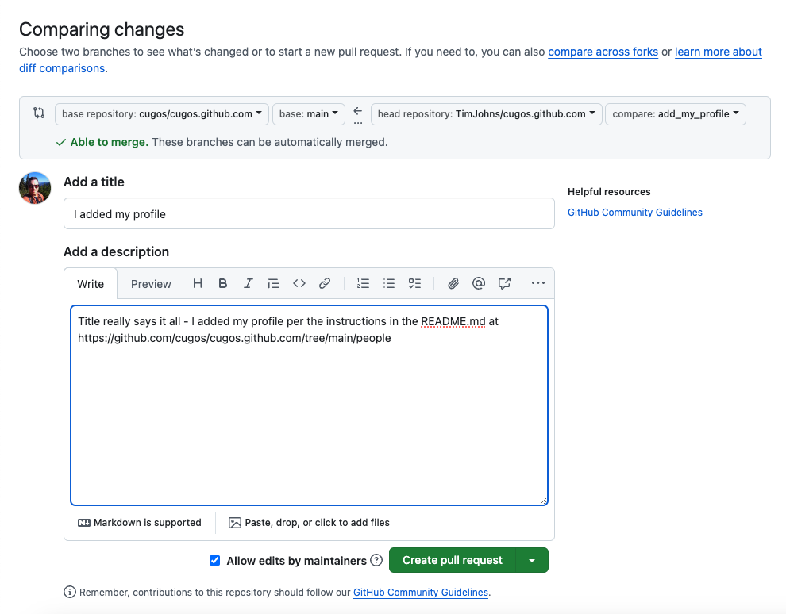

# Adding Your Profile

0. Create a GitHub Account<br/>


0. Go to the main `cugos.github.com` repository page<br/>


0. Fork the `cugos.github.com` repository<br/>


0. When prompted, choose your own account as the new fork owner, and leave "Copy the main branch only" checked, and click "Create fork".<br/>


0. You will be redirected to your forked repository page<br/>


0. We want to add our profile to the `people` directory<br/>


0. First click the "Code" dropdown, and copy the URL that we will use to clone our forked repository<br/>


0. Then in a bash shell on your computer find a good working directory. Clone your forked respository and follow the rest of the edit, commit, push and pull request workflow below. FYI: you will need to install `git` on your computer<br/>
    ```bash
    $ git clone https://github.com/TimJohns/cugos.github.com.git
    Cloning into 'cugos.github.com'...
    remote: Counting objects: 4148, done.
    remote: Compressing objects: 100% (64/64), done.
    remote: Total 4148 (delta 29), reused 0 (delta 0), pack-reused 4084
    Receiving objects: 100% (4148/4148), 35.26 MiB | 4.93 MiB/s, done.
    Resolving deltas: 100% (2337/2337), done.
    Checking connectivity... done.
    ```

    Create a new local branch to add your profile changes<br/>
    ```bash
    $ cd cugos.github.com/
    $ git checkout -b add_my_profile
    Switched to a new branch 'add_my_profile'
    ```

    Go find the `people/_posts/` directory<br/>
    ```bash
    $ cd people/_posts/
    ```

    Copy the lastest profile and swap it out with your information. Use [bboxfinder](http://bboxfinder.com) to find your coordinates if necessary<br/>
    ```bash
    $ cp 2018-11-10-ranek_kiil.markdown 2025-02-20-tim-johns.markdown
    ---
    
    title: < your name >
    category: people
    lng: < your lng >
    lat: < your lat >
    image:  < your img >
    github: < your github username >
    twitter: < your twitter username >
    permalink: /people/< your name >
    excerpt: < your description >
    ---
    ```

    `git` add the file to staging<br/>
    ```bash
    $ git add 2025-02-20-<first>-<last>.markdown
    ```

    `git` commit the file with a commit message<br/>
    ```bash
    $ git commit -m "adding myself, because CUGOS rocks"
    ```

    `git` push the change to your remote branch<br/>
    ```bash
    $ git push origin add_my_profile # or whatever your branch name is 
    ```

0. Then go back to the GitHub page of your forked repository, change to the main branch and refresh. You should see something like:<br/>


0. Click that green button. Now add a commit message


0. When you feel confident and worthy to pledge your honor to the CUGOS family click that green button


Go drink a beer, you did a good job, and read up on the [git workflow](http://rogerdudler.github.io/git-guide/)
